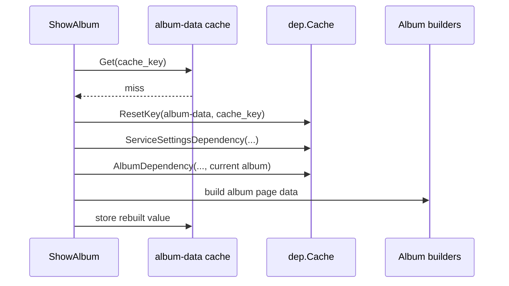
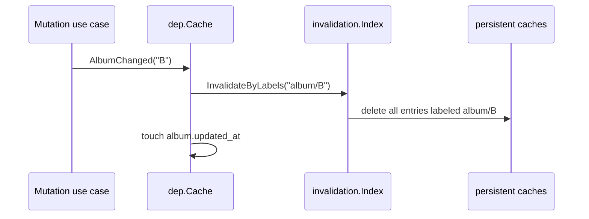
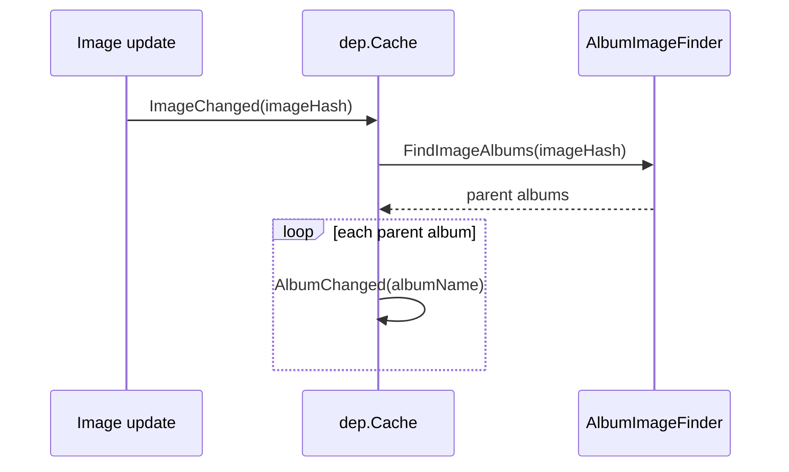
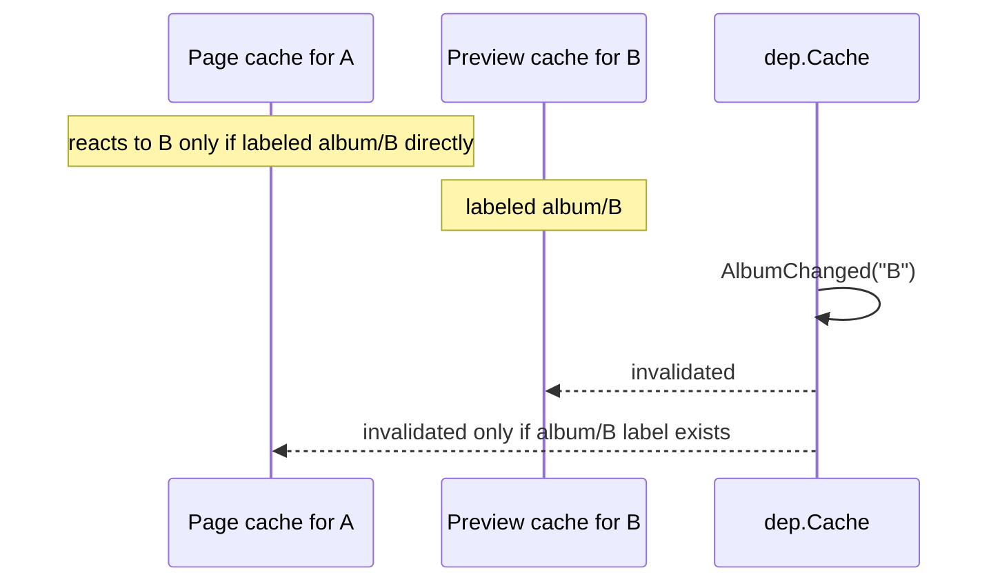

# Dependency Labels And Invalidation

This package is the app-level dependency tracker for persistent caches.

It answers two questions:

1. what labels affect a cached entry?
2. what should be dropped when a label changes?

The implementation uses `pkg/sqlitec/invalidation.Index` as a persistent label index and `dep.Cache` as the app-facing service.

## Core Model

Each cached entry is identified by:

- `cache_name`
- `cache_key`

Each cached entry may have zero or more labels, for example:

- `album-list`
- `service-settings`
- `album/<album-name>`

When a label changes, the invalidation index finds all cache entries carrying that label and deletes them from their registered cache backend.

## API

### Register labels

- `AlbumListDependency(cacheName, cacheKey)`
- `AlbumDependency(cacheName, cacheKey, albumNames...)`
- `ServiceSettingsDependency(cacheName, cacheKey)`

### Invalidate by label

- `AlbumListChanged(ctx)`
- `AlbumChanged(ctx, albumName)`
- `ServiceSettingsChanged(ctx)`

### Reset labels before rebuild

- `ResetKey(ctx, cacheName, cacheKey)`

`ResetKey` matters because dependency sets can shrink over time. Without it, stale labels would remain attached and cause false-positive invalidation later.

The intended rebuild flow is:

1. `ResetKey`
2. rebuild cached value
3. register current labels again

## Labels Used In This App

### `album-list`

Meaning:

- the cached entry depends on the set of albums as a whole

Used by:

- main page cache

Invalidated by:

- album creation
- album deletion

### `service-settings`

Meaning:

- the cached entry depends on global service settings

Used by:

- main page cache
- album page cache

Invalidated by:

- settings changes through `settings.Manager`

### `album/<name>`

Meaning:

- the cached entry depends on a specific album’s content or metadata

Used by:

- album page cache for the album itself
- album preview cache for sub-albums
- main page cache for featured album and preview tiles
- thumb-grid cache
- potentially sprite manifests if sprite retirement is integrated with invalidation

Invalidated by:

- `AlbumChanged(ctx, name)`

## Flows In This App

## 1. Main Page

Cache:

- `cache_name = "main-page"`
- key varies by admin mode and language

Labels attached on rebuild:

- `service-settings`
- `album-list`
- featured album, when configured:
  - `album/<featured>`
- every album preview rendered on the page:
  - `album/<album>`

Effect:

- changing featured album invalidates main page
- changing any album shown on main page invalidates main page
- changing album list invalidates main page
- changing settings invalidates main page

## 2. Album Page

Cache:

- `cache_name = "album-data"`
- key varies by album name, admin mode, and language

Labels attached on rebuild:

- `service-settings`
- `album/<current album>`

Additionally, for each visible sub-album preview rendered inside the album page:

- preview cache entry is rebuilt for that sub-album
- the preview cache entry gets:
  - `album/<sub-album>`

Effect:

- changing album `A` invalidates album page `A`
- changing sub-album `B` invalidates preview cache entry `B`

There is no transitive invalidation in the label index itself. If a separate cache entry should react to `B`, it must also carry `album/B` directly.

## 3. Parent Album With Sub-Album Preview

Suppose album `A` renders a preview of sub-album `B`.

The important distinction is:

- page cache entry for `A`
- preview cache entry for `B`

The preview cache entry for `B` is labeled with:

- `album/B`

If the page cache for `A` itself also wants to react to `B`, then `A`’s page cache entry must also carry:

- `album/B`

This is the key rule of the current system:

- invalidation is direct, not transitive

If `AlbumChanged("B")` runs:

- every cache entry labeled `album/B` is dropped
- entries labeled only `album/A` are not touched

## 4. Thumb Grid

Cache:

- `cache_name = "thumb-grid"`

Labels attached on rebuild:

- `album/<name>`

Effect:

- when album changes, the corresponding thumb grid is invalidated and rebuilt on next request

## 5. Settings Update

`settings.Manager.set(...)` calls:

- `ServiceSettingsChanged(ctx)`

That invalidates all entries labeled:

- `service-settings`

Currently this affects:

- main page
- album page

## 6. Album Create / Delete / Modify

Typical triggers:

- add photo to album
- remove photo from album
- update image data through control API
- set album image time
- process uploaded file
- update album metadata
- delete album

Most content-changing actions call:

- `AlbumChanged(ctx, albumName)`

Album list structure changes also call:

- `AlbumListChanged(ctx)`

Effect of `AlbumChanged(ctx, name)`:

1. invalidate all cache entries labeled `album/<name>`
2. update `album.updated_at`

The `updated_at` touch is separate from invalidation; it supports other cache strategies that rely on album timestamps.

## 7. Image Update

Image updates do not label album pages by image hash.

That would be the wrong granularity:

- too many labels per album page
- too much churn on image edits
- larger invalidation index with little benefit

Instead, image changes are translated into album invalidations at mutation time.

Flow:

1. an image is updated, for example description or timestamp metadata
2. `DepCache.ImageChanged(ctx, imageHash)` is called
3. it resolves parent albums with `FindImageAlbums(..., imageHash)`
4. it calls `AlbumChanged(ctx, album.Name)` for each affected album

Effect:

- album caches remain labeled only by album names
- image changes still invalidate all affected albums
- no per-image labels are stored on album cache entries

## Non-Transitive Nature

This is the most important thing to keep in mind.

`InvalidationIndex` does not infer second-order relationships.

Example:

- page `A` uses preview `B`
- preview `B` is invalidated

That does **not** automatically invalidate page `A` unless page `A` is also labeled with:

- `album/B`

So if entity `X` should react to album `B`, `X` must be labeled with `album/B` directly.

## Mermaid Examples

### Album Page Rebuild

### Album Change

### Image Change

### Parent / Sub-Album Case

## Practical Rule

When adding a persistent cache entry, ask:

- which albums contribute to this value?
- which global settings contribute to this value?
- does it depend on album list membership?

Then:

1. `ResetKey`
2. attach every direct dependency label
3. rebuild and store the value

If a cache entry should react to an album change, it must carry that album label directly.

For image edits, the app deliberately does not model dependencies as:

- `image/<hash>`

on album page caches.

Instead it resolves:

- `image -> albums`

at mutation time and invalidates those albums directly.
