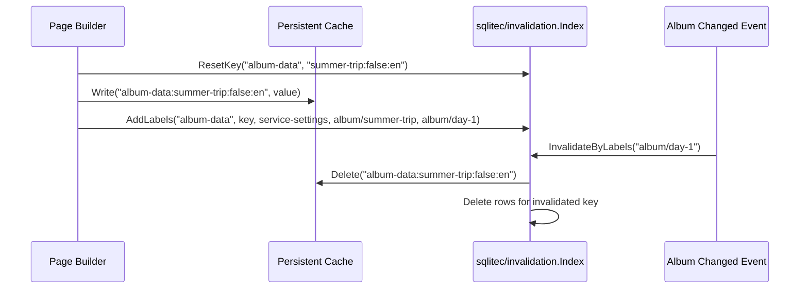

# `sqlitec/invalidation`

`sqlitec/invalidation` provides a SQLite-backed invalidation index for caches whose
dependency graph must survive process restarts.

It is a sibling of `sqlitec.DBMapOf`:
- `sqlitec.DBMapOf` stores cache values.
- `sqlitec/invalidation.Index` stores dependency labels for those cache values.

This package is useful when:
- cache entries are persisted on disk,
- invalidation must keep working after restart,
- one cache key depends on multiple entities,
- one entity invalidates multiple cache keys.

## Data Model

The index stores rows of:

- `cache_name`
- `cache_key`
- `label`

Conceptually this is a many-to-many relation:

- one cache key can have many labels,
- one label can point to many cache keys.

## Core API

- `AddCache(name, deleter)`
- `AddLabels(cacheName, key, labels...)`
- `InvalidateByLabels(ctx, labels...)`
- `ResetKey(ctx, cacheName, key)`

## Why `ResetKey` Exists

`AddLabels` is additive.

If a cache entry is rebuilt and its dependency set changes, old labels must be removed
before new ones are registered. Otherwise, stale label rows remain and later cause false
positive invalidations.

That is why a normal rebuild flow is:

1. `ResetKey(...)`
2. rebuild cache value
3. `AddLabels(...)` for current dependencies

This does not change stale-value correctness. It improves invalidation precision.

## Example Flow

Assume:

- cache name: `album-data`
- cache key: `summer-trip:false:en`
- page currently depends on:
  - `service-settings`
  - `album/summer-trip`
  - `album/day-1`

### Build

```go
cacheKey := []byte("summer-trip:false:en")

if err := idx.ResetKey(ctx, "album-data", cacheKey); err != nil {
	return err
}

idx.AddLabels("album-data", cacheKey,
	"service-settings",
	"album/summer-trip",
	"album/day-1",
)
```

### Invalidate

When `album/day-1` changes:

```go
_, err := idx.InvalidateByLabels(ctx, "album/day-1")
```

The index will:

1. find all distinct `(cache_name, cache_key)` pairs for that label,
2. call the registered deleter for `album-data`,
3. remove label rows for invalidated keys.

## Example Sequence



## Typical Split of Responsibilities

In an application with both in-memory and persistent caches:

- use `cache.InvalidationIndex` for purely in-memory caches,
- use `sqlitec/invalidation.Index` for persistent caches,
- make sure one cache name belongs to one invalidation domain.

## Notes

- Deleters are runtime-only and are not persisted.
- Dependency rows are persisted.
- `InvalidateByLabels` is safe in the sense that stale rows only cause extra invalidation,
  not missed invalidation.
