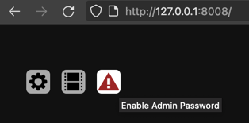
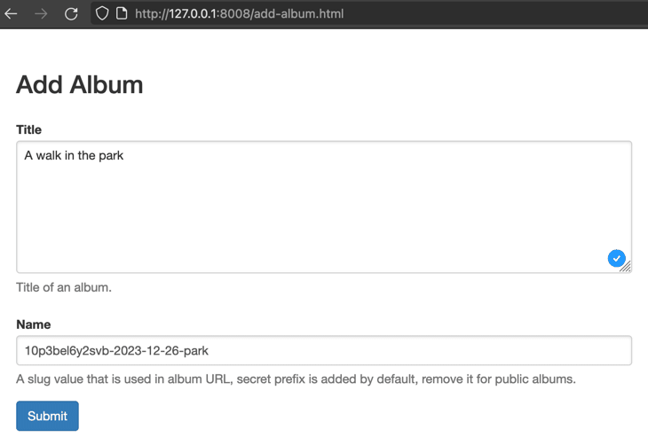
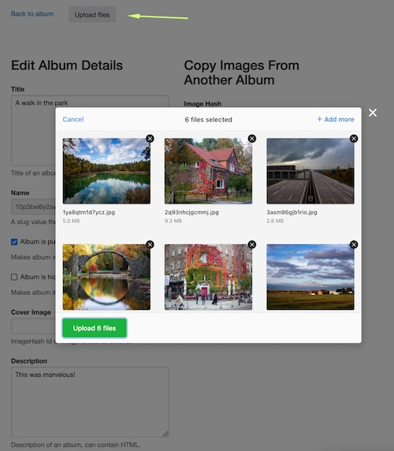
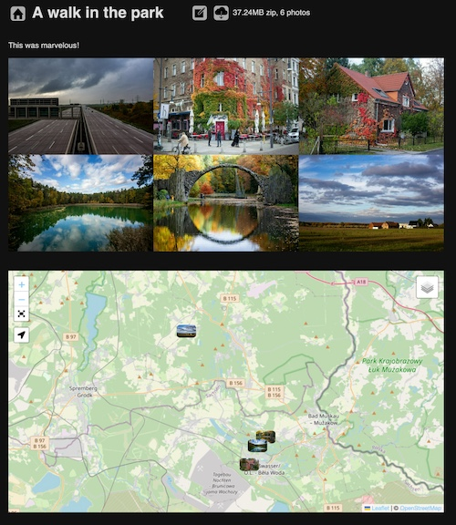
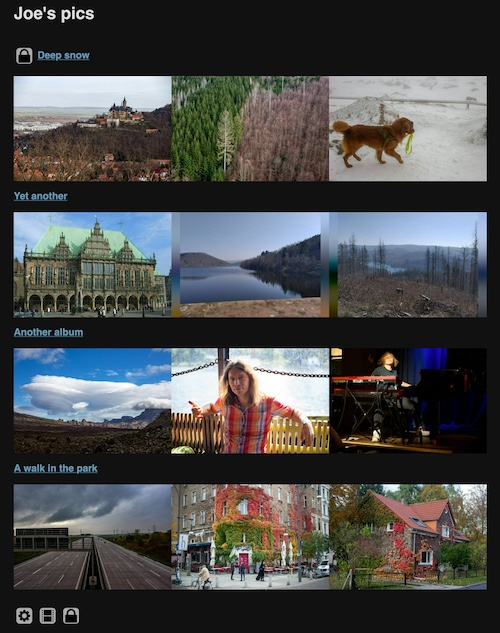

:::{lang=en}

## Adding First Album

Once you've started the `photo-blog` application, it will create a storage directory `photo-blog-data` in your
current directory. This new directory will contain all state of the app.

The app will serve on port `8008`, you open http://127.0.0.1:8008/ if you run it locally.



It might be a good idea to set admin password, to restrict access to albums management. Once the password is set,
browser will asc you for name and password, name can be anything, password should be the one you've set.

Application settings are available under gear button. You can set your site title and some other parameters there.

Then click on a film button to add an album.



Name can not be changed later (though you can always create a copy of album with a new name and delete the old one)
and will act as a part of URL to the new album.

Name is started with a random prefix by default, this is to hide private albums from people that can guess a name.
Remove this random prefix if you intend to make the album public. Please note, URL-protected private albums are not
sufficiently secure for really sensitive data. Private URL can leak to search engines from your browser, it can be
overshared by people you gave access without your control.



Once you've created an album, you will be redirected to a page where cat edit more details and upload pictures.

Technical details (EXIF) are retrieved from images on upload. Images with geolocation are shown on the map.

You can also upload [GPX](https://en.wikipedia.org/wiki/GPS_Exchange_Format) files, they will be shown on the map too.

Click "Back to album" to open album page.

:::

:::{lang=ru}

## Добавление первого альбома

Как только вы запустите приложение `photo-blog`, оно создаст в вашей текущей директории поддиректорию `photo-blog-data` 
для своих файлов. Эта новая директория будет хранить все без исключения данные приложения.

Приложение запустит веб-сервер на порту `8008`, вы сможете открыть http://127.0.0.1:8008/ если запустили приложение локально.


Для ограничения доступа управлению альбомами вы можете установить пароль администратора. 
Как только пароль будет сохранен, браузер начнет спрашивать имя и пароль для определенных страниц. 
Имя может быть любым, а пароль - тем что вы установили.

Настройки приложения доступны по кнопке шестеренки. Там можно установить название сайта и некоторые другие параметры.

Затем щелкните кнопку с пленкой, чтобы добавить новый альбом.


Имя альбома не может быть изменено в будущем (хотя можно создать еще один новый альбом, скопировать в него содержимое 
старого, и затем удалить старый), и является частью URL альбома.

Имя начинается со случайной строки по умолчанию, т.к. приватные альбомы доступны только по ссылке и
случайная строка затрудняет "угадывание". Сотрите этот префикс если вы планируете публичный альбом.
Имейте в виду, что защита секретной ссылкой имеет слабую эффективность, не выкладывайте особо важную информацию в 
приватных альбомах. Существует риск, что секретные ссылки могут утекать из браузера в поисковые системы или 
распространяться ненадежными получателями.


Как только вы создадите альбом, вы будете перенаправлены на страницу где можно отредактировать параметры и загрузить 
фотографии. 

Технические данные (EXIF) индексируются при загрузке. Изображения с геометками показываются на карте.

Вы можете также загрузить [GPX](https://en.wikipedia.org/wiki/GPS_Exchange_Format) треки, они тоже будут показаны на карте.

Перейдите по ссылке "Back to album", чтобы открыть альбом.

:::

:::{lang=en}

## Album Page

Main part of album page is a gallery of images that can be shown full screen at maximum resolution.



Get back to editing album/adding more photos with a pencil button on top.

Image and GPX files are identified and deduplicated by hash of their content. So, if you've uploaded a photo
to one album, and then uploaded the same photo to another album, second upload will be ignored and reference (hash)
to the first file will be used instead.

Hash is a part of image URL (underlined in the following screenshot).


Album and image links are shareable, and will show a preview image. You can choose image as a cover for an album
and fill in its hash in album details.


When you browse gallery as admin, you will have more control buttons.


Images of the album are ordered chronologically with an option to reverse the order.

Click home button to open main page.

:::

:::{lang=ru}

## Страница альбома

Основная часть страницы альбома - это галерея, которая может показывать фотографии в полный экран с максимальным 
разрешением.


Вернуться к редактированию альбома можно через кнопку с карандашом вверху экрана.

Файлы изображений и GPX идентифицируются и дедуплицируются на основаниия хэша их содержимого. Таким образом, 
если вы загрузили фото в один альбом, а затем то же самое фото в другой альбом, вторая загрузка будет проигнорирована и 
ссылка на первый файл будет использована во втором альбоме.

Хэш - часть URL изображения (подчеркнут в следующем скриншоте).


Ссылками на альбом или фотографию можно делиться, они будут отображаться с предпросмотром фотографии. Вы можете выбрать
обложку альбома и настроить ее хэшем изображения в параметрах альбома.


Когда вы просматриваете галерею как администратор, вам доступно больше кнопок управления.


Изображения в альбоме отсортированы хронологически с опцией обратной сортировки.

Нажмите на кнопку с домом для перехода на главную страницу.

:::


:::{lang=en}

## Main Page



Each album (that does not have "Hidden" option enabled) will be listed on the main page.
Private albums are only listed if you're logged in as admin.

Login button or admin controls are shown at the bottom of the page.
Login button can be hidden in [privacy settings](/edit/settings.html).

### Featured Photos

Main page starts with a gallery of featured photos.
When you watch photos as admin, you can click the star button to mark current photo as featured.


You can remove photo from featured by clicking trash bin button.


:::

:::{lang=ru}

## Главная страница


Каждый альбом (у которого не включена опция "hidden") будет показан на главной странице.
Приватные альбомы находятся в списке только для администратора.

Кнопка авторизации или элементы управления находятся внизу страницы.
Кнопка авторизации может быть спрятана с помощью [privacy settings](/edit/settings.html).

### Избранные фотографии

Главная страница начинается галереей избранных фотографий.
Когда вы просматриваете альбомы как администратор, вы можете нажать на звезду, чтобы добавить фотографию в избранное.


Когда вы просматриваете избранные фотографии, вы можете убрать фотогафию из избранного используя значок корзины. 
При этом фотография останется во всех остальных альбомах, где она была прежде.


:::


:::{lang=en}

## Text

Both images and albums can have text descriptions. [Markdown](https://www.markdownguide.org/basic-syntax/)
and HTML are supported markup languages. Brief overview of [syntax](markdown.md).

### Multilingual content

You can provide text in multiple languages by using fences (`:::`) syntax.
Supported languages should be configured in [language settings](/edit/settings.html).

:::

:::{lang=ru}

## Текст

Как альбомы, так и изображения могут иметь текстовые описания. [Markdown](https://www.markdownguide.org/basic-syntax/)
и HTML поддерживаются как языки разметки. Краткое описание [синтаксиса](markdown.md).


### Многоязычное содержание

Вы можете добавлять описания на нескольких языках используя заборчиковый синтаксис.
Поддерживаемые языки можно настроить в [language settings](/edit/settings.html).

:::


```
:::{lang=en}
Faro, Portugal
:::

:::{lang=ru}
Фару, Португалия
:::

:::{lang=en}
Something in english again.
:::
```

:::{lang=en}

### Chronological Texts

When you want to tell a story between the pictures, you can add texts with timestamps in album details. 


Photos in album are ordered chronologically, and texts will be shown in a relevant position.


:::

:::{lang=ru}

### Хронологические комментарии 

Когда вы хотите рассказать историю между фотографий, вы можете добавить тексты с временными метками в найтройках 
альбома.


Фотографии в альбоме отсортированы хронологчески, и тексты будут показаны в контексте.


:::

